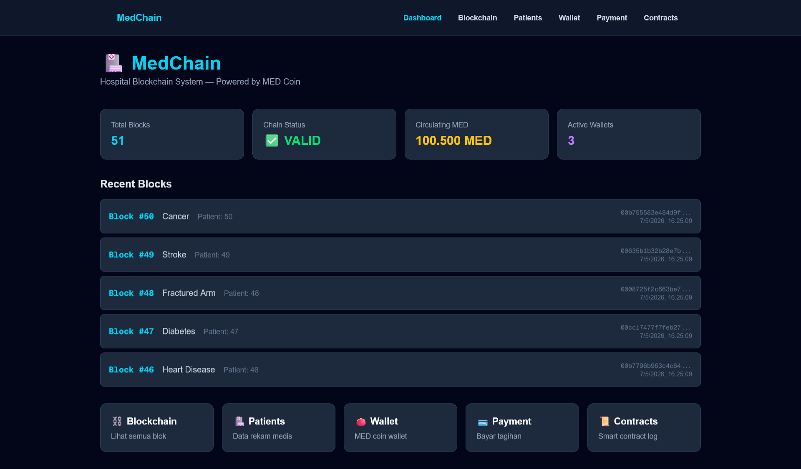
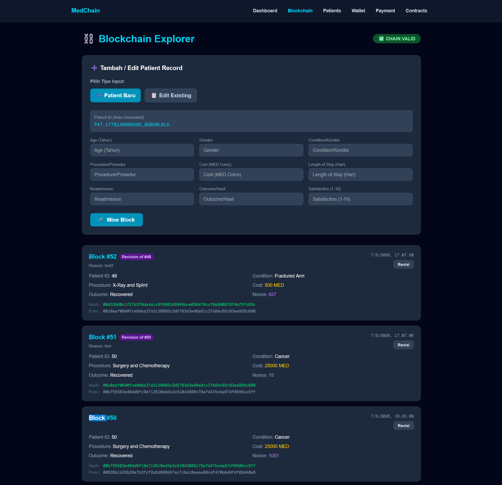
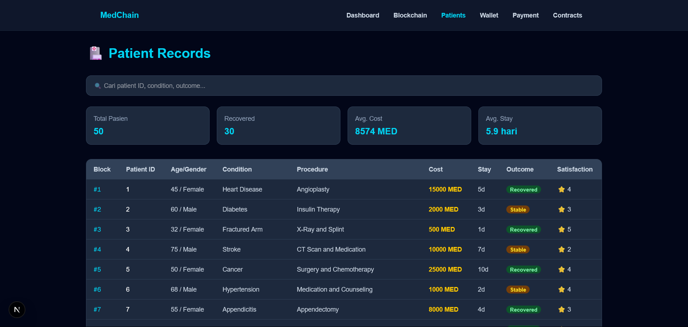
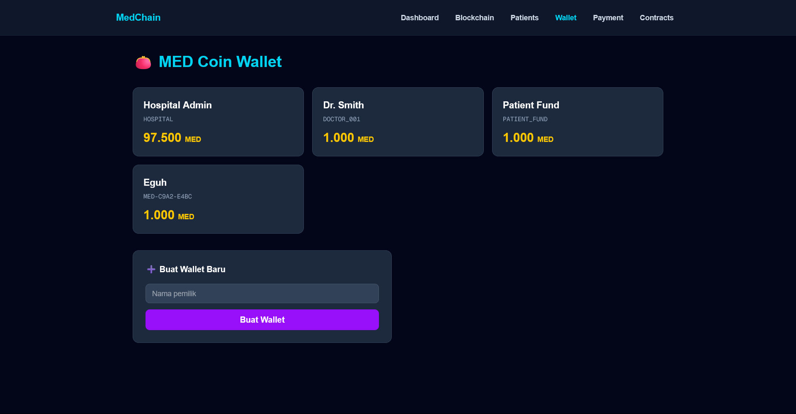
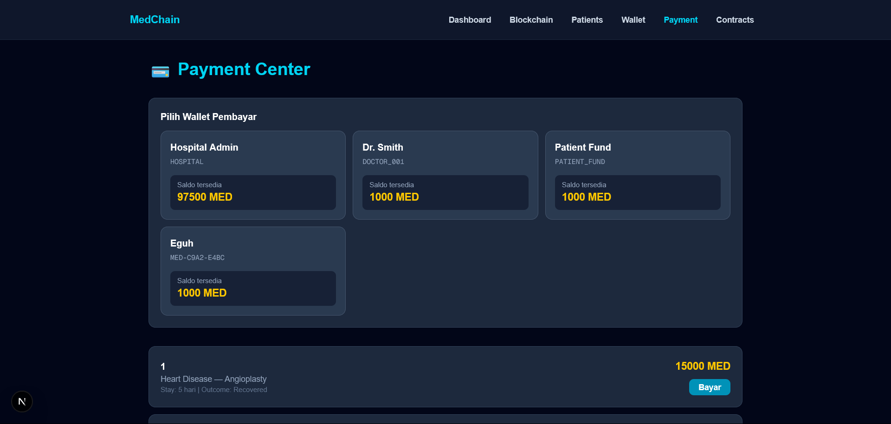
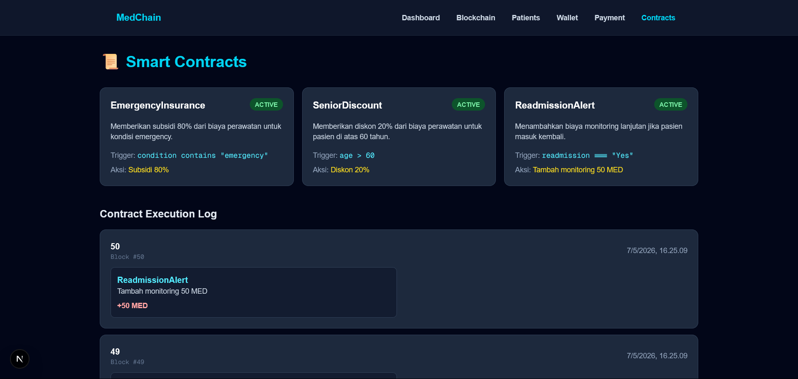

# Laporan Final Hospital Blockchain

## Identitas Pembuat

- Nama: Eguh Raga Mustika
- NIM: 23533791
- Mata Kuliah: Blockchain
- Project: Hospital Blockchain / MedChain

## Deskripsi Singkat

Hospital Blockchain adalah aplikasi web berbasis Next.js untuk simulasi pencatatan rekam medis pasien ke dalam blockchain sederhana. Setiap data pasien disimpan sebagai block, dilengkapi hash, previous hash, nonce, reward miner, wallet MED Coin, payment center, smart contract, dan persistent storage SQLite agar data tidak hilang saat server dihentikan.

## Teknologi yang Digunakan

- Next.js 16
- React 19
- TypeScript
- Tailwind CSS
- SQLite dengan `better-sqlite3`
- `crypto-js` untuk hashing block
- `uuid` untuk ID transaksi

## Fitur Utama

### 1. Dashboard

Dashboard menampilkan ringkasan sistem, seperti total block, status validitas chain, jumlah MED Coin yang beredar, dan jumlah wallet aktif. Dashboard juga menyediakan navigasi ke halaman Blockchain, Patients, Wallet, Payment, dan Smart Contracts.

Screenshot:



### 2. Blockchain Explorer

Halaman Blockchain Explorer digunakan untuk melihat semua block yang tersimpan. Setiap block menampilkan data pasien, hash, previous hash, nonce, timestamp, dan status validitas blockchain. User juga dapat menambahkan patient record baru dan membuat revision block jika data pasien perlu dikoreksi.

Screenshot:



### 3. Patient Records

Halaman Patient Records menampilkan data pasien dalam bentuk tabel. User dapat melakukan pencarian berdasarkan patient ID, condition, atau outcome. Saat baris pasien diklik, aplikasi menampilkan detail pasien dalam side panel, termasuk diagnosis, treatment, biaya, hasil smart contract, dan informasi blockchain.

Screenshot:



### 4. Wallet

Halaman Wallet digunakan untuk melihat daftar wallet MED Coin, saldo tiap wallet, membuat wallet baru, melakukan transfer MED Coin, dan melihat riwayat transaksi. Wallet default seperti Hospital Admin, Dr. Smith, dan Patient Fund dibuat otomatis.

Screenshot:



### 5. Payment Center

Halaman Payment Center digunakan untuk membayar biaya perawatan pasien menggunakan wallet. Wallet ditampilkan dalam bentuk card agar proses pemilihan lebih mudah. Sebelum pembayaran diproses, aplikasi menampilkan popup konfirmasi pembayaran.

Screenshot:



### 6. Smart Contracts

Halaman Smart Contracts menampilkan daftar contract aktif dan log eksekusi contract dari data blockchain. Contract yang tersedia:

- EmergencyInsurance: jika condition mengandung kata `emergency`, pasien mendapat subsidi 80% dari cost.
- SeniorDiscount: jika age lebih dari 60, pasien mendapat diskon 20% dari cost.
- ReadmissionAlert: jika readmission bernilai `Yes`, pasien mendapat tambahan biaya monitoring 50 MED.

Screenshot:



### 7. Revision Block

Fitur Revision Block digunakan ketika data rekam medis perlu diperbaiki, misalnya condition, procedure, cost, length of stay, readmission, outcome, atau satisfaction. Identitas utama seperti Patient ID dikunci agar revisi tetap merujuk ke pasien yang sama. Sistem tidak mengubah block lama secara langsung karena hal tersebut akan merusak konsep immutability blockchain.

Alur revisi:

1. Miner memilih block pasien yang ingin direvisi.
2. Sistem membuka modal edit data rekam medis.
3. Miner mengisi perubahan dan alasan revisi.
4. Sistem menampilkan popup konfirmasi.
5. Setelah dikonfirmasi, sistem menambang block baru.
6. Block baru menyimpan metadata `revisionOf` dan `revisionReason`.
7. Block lama tetap tersimpan sebagai riwayat asli.
8. Patient ID pada block revisi tetap mengikuti Patient ID dari block asal.

Dengan cara ini, perubahan data tetap tercatat transparan tanpa menghapus atau memodifikasi histori lama.

## Alur Kerja Sistem

1. Aplikasi dijalankan dengan Next.js.
2. Saat server pertama kali aktif, sistem membuat database SQLite `hospital.db` di root project.
3. Database membuat tabel `blocks`, `wallets`, dan `transactions` jika belum ada.
4. Jika database belum memiliki block pasien dan file `public/data/patients.csv` tersedia, sistem melakukan seed otomatis dari CSV.
5. Jika CSV tidak ada, sistem tetap berjalan tanpa error dan hanya menggunakan data yang sudah ada di SQLite.
6. User dapat menambahkan data pasien melalui halaman Blockchain.
7. Data pasien akan dibuat menjadi block baru, di-hash, di-mine, lalu disimpan ke SQLite.
8. Miner mendapat coinbase reward MED Coin.
9. Smart contract dieksekusi untuk mengecek apakah data pasien memenuhi kondisi tertentu.
10. User dapat membuka halaman Patients untuk melihat detail pasien dan hasil smart contract.
11. User dapat menggunakan Wallet untuk transfer MED Coin antar wallet.
12. User dapat menggunakan Payment Center untuk membayar tagihan pasien.
13. Jika data pasien perlu dikoreksi, miner membuat revision block baru yang merujuk ke block lama.
14. Semua block, wallet, dan transaksi tersimpan di SQLite sehingga tidak hilang saat server dihentikan.

## Struktur Penyimpanan Database

Database menggunakan file:

```txt
hospital.db
```

Tabel yang digunakan:

- `blocks`: menyimpan data block, data pasien, hash, nonce, miner, dan transaksi block.
- `wallets`: menyimpan address wallet, owner, dan balance.
- `transactions`: menyimpan transaksi MED Coin, termasuk transfer, payment, dan coinbase reward.

## Inisialisasi MED Coin

Inisialisasi koin berada di file `lib/medcoin.ts`, tepatnya pada constructor class `MEDCoin`.

Saat sistem pertama kali berjalan, MED Coin melakukan beberapa proses:

1. Menentukan total supply MED Coin sebesar `1_000_000`.
2. Meload seluruh riwayat transaksi dari SQLite.
3. Meload semua saldo wallet yang sudah tersimpan di tabel `wallets`.
4. Jika wallet `HOSPITAL` belum ada, sistem memberi saldo awal `100000 MED`.
5. Wallet internal `COINBASE` digunakan sebagai sumber reward mining.

Potongan konsep inisialisasi:

```ts
this.totalSupply = 1_000_000;
this.transactionHistory = getAllTransactions().reverse();
this.balances = new Map();

getAllWallets().forEach((wallet) => {
  this.balances.set(wallet.address, wallet.balance);
});

if (!this.balances.has('HOSPITAL')) {
  this.balances.set('HOSPITAL', 100000);
}

this.balances.set('COINBASE', this.totalSupply);
```

Wallet default dibuat di `lib/wallet.ts`, yaitu:

- `Hospital Admin` dengan address `HOSPITAL`
- `Dr. Smith` dengan address `DOCTOR_001`
- `Patient Fund` dengan address `PATIENT_FUND`

Namun saldo koin tetap dikontrol oleh `lib/medcoin.ts`.

### Pencegahan Inflasi Saat Membuat Wallet Baru

Pada versi awal, wallet baru langsung mendapat saldo awal `1000 MED`, sehingga total saldo beredar dapat bertambah tanpa sumber dana yang jelas. Hal ini dapat menyebabkan inflasi di sistem.

Fitur tersebut kemudian diperbaiki. Sekarang saat wallet baru dibuat:

1. Wallet baru didaftarkan dengan saldo `0`.
2. Sistem melakukan transfer `1000 MED` dari wallet `HOSPITAL` ke wallet baru.
3. Saldo `HOSPITAL` berkurang `1000 MED`.
4. Transaksi funding dicatat di tabel `transactions`.

Dengan alur ini, saldo wallet baru berasal dari rumah sakit, bukan dibuat dari udara. Total MED yang beredar tetap lebih terkontrol.

## Cara Menjalankan Project

### 1. Extract Project

Extract folder project yang dikirim, lalu buka terminal di root project:

```bash
cd hospital-blockchain
```

### 2. Install Dependency

Jalankan:

```bash
npm install
```

Dependency penting yang digunakan:

```bash
npm install better-sqlite3
npm install --save-dev @types/better-sqlite3
```

Jika dependency sudah ada di `package.json`, cukup menjalankan `npm install`.

### 3. Jalankan Development Server

```bash
npm run dev
```

Lalu buka browser:

```txt
http://localhost:3000
```

### 4. Build Production

Untuk memastikan project bisa dibuild:

```bash
npm run build
```

Untuk menjalankan hasil build:

```bash
npm run start
```

## Kesimpulan

Project ini berhasil mengimplementasikan simulasi hospital blockchain dengan penyimpanan persistent SQLite. Sistem memiliki fitur pencatatan rekam medis berbasis block, wallet MED Coin, transaksi pembayaran, smart contract otomatis, dan tampilan web dark theme yang saling terintegrasi.
